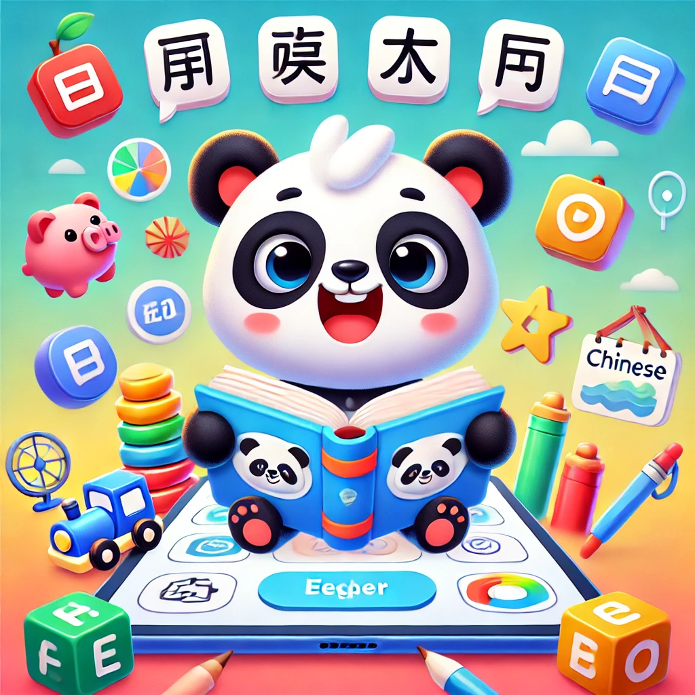
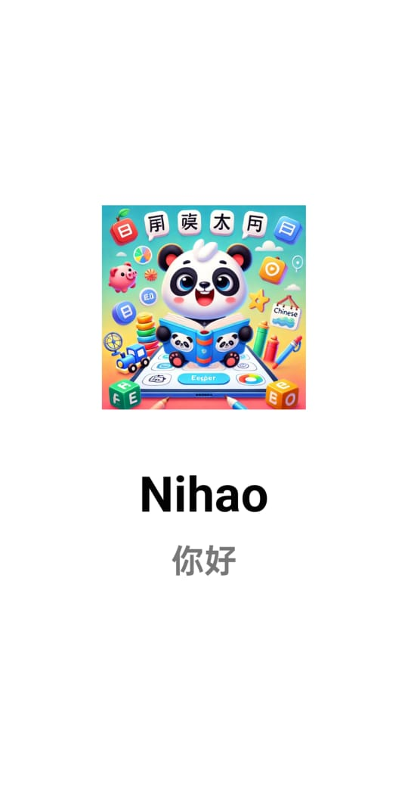
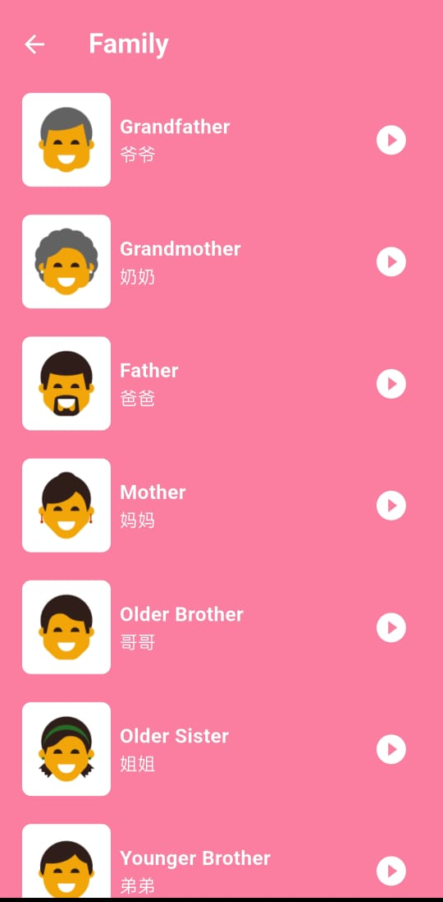
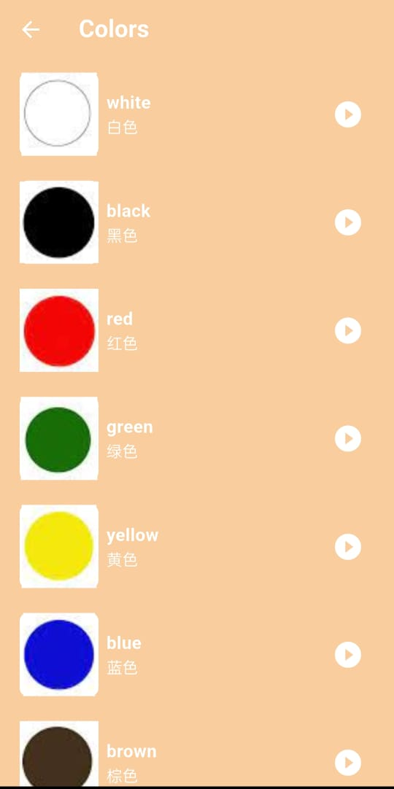
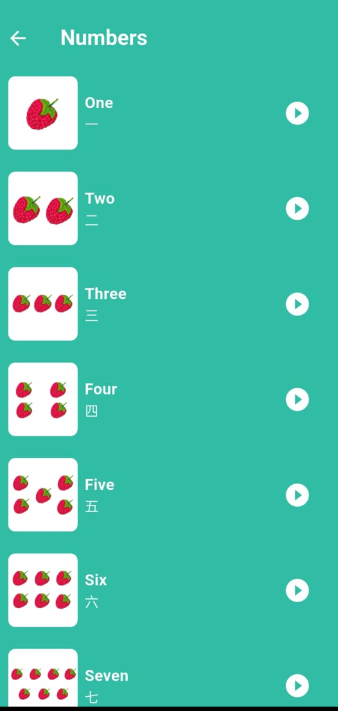
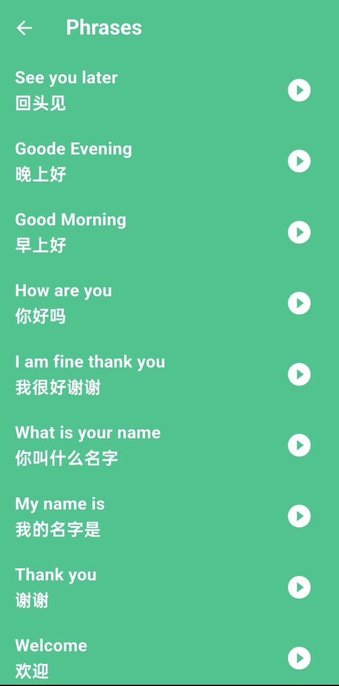

<p align="center">
  
</p>

---

# 📱 NiHao

**NiHao** is a fun and interactive Chinese learning app designed for kids. It teaches basic vocabulary—colors, numbers, family members, and common phrases—through a kid‑friendly UI complete with a splash screen, smooth animations, and a fully responsive design. Built with Flutter, NiHao offers an engaging experience that makes early language learning easy and enjoyable.

---

## 🌟 Features

- 🧒 Bright, playful UI tailored to young learners
- 🎨 Learn Chinese colors with vivid illustrations
- 🔢 Practice numbers 1–10 with audio pronunciation
- 👨‍👩‍👧‍👦 Family member vocabulary section
- 🗣️ Voice‑over for each word and phrase
- 🏃‍♂️ Smooth animations & splash screen
- 📱 Fully responsive layout on all device sizes

---

## 📸 Screenshots

<p float="left">
  
  
  
  
  
  
</p>

---

## 🛠️ Tech Stack

- **Flutter** — Cross‑platform UI toolkit
- **Dart** — Primary programming language
- **audioplayers** — Audio playback
- **Cubit** or **Provider** — State management
- **Shared Preferences** — Local data persistence

---

## 📋 Requirements

- ✅ Flutter 3.0 or higher
- ✅ Dart SDK
- ✅ Android SDK / Xcode for iOS builds

---

## ⚙️ Installation

```bash
# 1. Clone the repo
git clone https://github.com/your-username/nihao-app.git

# 2. Navigate into the project
cd nihao-app

# 3. Install dependencies
flutter pub get

# 4. Run on device or emulator
flutter run
